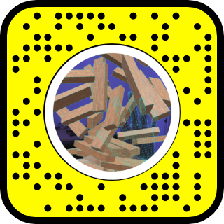

## Intro

This lens was created as a challenge. As this was my first time using Lens Studio (and Snapchat as a matter of fact), I resorted to using mostly available assets and customising them to my needs.
As the title suggests, the game simply simulates Jenga with no gravity.It's fairly unpolished, and the controls are a bit too rough, but that's part of the charm.

## How to play

The game takes advantage of Snapchat's AR features, allowing the player to move around the tower and interact with it using their own hands.
Because of this, the game has to be played through the rear camera.
A button is available to reset the tower. This will destroy the current tower, and build a new one in its original position. If the position is not convenient, at the moment the only way to change it is to close and re-open the lens.

## Potential improvements

- an easy one could be a few sliders, to move the tower in different axis or scale it. This could allow the player to place it where they find it most comfortable.
- potentially an area (collider?) surrounding each block. This could be used for visual feedback, as right now it's really hard to tell how far apart objects are.
- Ideally a grab feature. I did implement one but ended up discarding it as it was not precise enough, harder than the current "collision" based system.

## Try it

Alternatively available [here](https://www.snapchat.com/unlock/?type=SNAPCODE&uuid=cf61b88ec34241b59e4c8373eaf2bea6&metadata=01).
